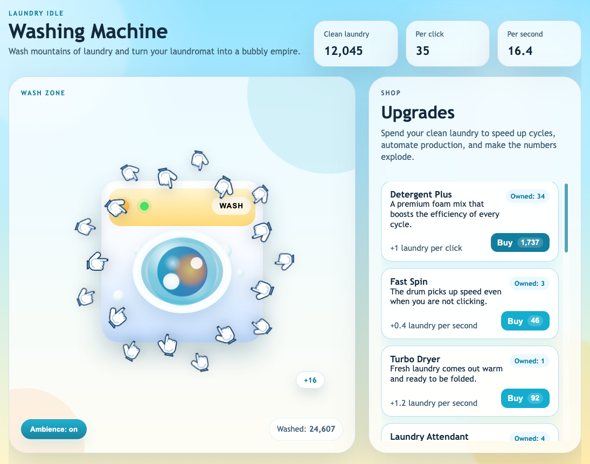

# Washing Machine

A playful idle clicker game built with vanilla HTML, CSS, and JavaScript. Click the washing machine to produce clean laundry, buy upgrades, unlock passive income, and grow your laundromat into a bubbly production empire.

## Features

- Click-to-earn core loop with animated washing machine feedback
- Upgrade shop with scaling costs and late-game progression
- Passive income system for idle growth
- Orbiting cursor hands inspired by classic clicker games
- Floating click feedback and ambient laundromat sound
- Auto-save with `localStorage`
- GitHub Pages deployment workflow

## Upgrades

| Upgrade | Base cost | Per click | Per second | Description |
| --- | ---: | ---: | ---: | --- |
| Detergent Plus | 15 | +1 | +0 | A premium foam mix that boosts the efficiency of every cycle. |
| Fast Spin | 30 | +0 | +0.4 | The drum picks up speed even when you are not clicking. |
| Turbo Dryer | 80 | +0 | +1.2 | Fresh laundry comes out warm and ready to be folded. |
| Laundry Attendant | 180 | +0 | +3.5 | Someone watches the floor while production keeps climbing. |
| Industrial Line | 420 | +3 | +8 | A full line of machines turns the laundromat into a factory. |
| Bubble Cannon | 900 | +5 | +14 | A foam-blasting cannon that launches spotless loads at absurd speed. |
| Fold Bot Squad | 1,800 | +2 | +26 | A synchronized crew of folding robots keeps the clean stacks moving nonstop. |
| Foam Reactor | 4,200 | +12 | +55 | A glowing suds core supercharges every wash cycle like a tiny sci-fi sun. |
| Orbital Laundromat | 9,500 | +24 | +125 | A ring of zero-gravity washers spins above the city cleaning laundry in orbit. |
| Black Hole Washer | 22,000 | +55 | +280 | An impossible washer bends space, time, and detergent into pure output. |
| Time Loop Laundry | 50,000 | +120 | +620 | Tomorrow's clean laundry arrives today, again and again and again. |

## Play locally

1. Clone the repository.
2. Open `index.html` in a browser.

No build step and no dependencies are required.

## Project structure

- `index.html`: game layout
- `styles.css`: art direction, layout, animation, responsive behavior
- `script.js`: game loop, upgrades, rendering, audio, persistence
